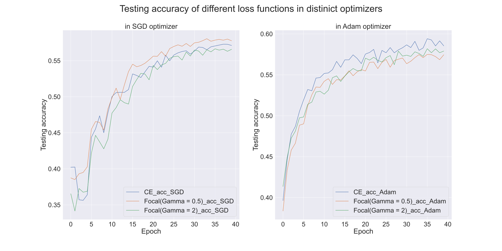
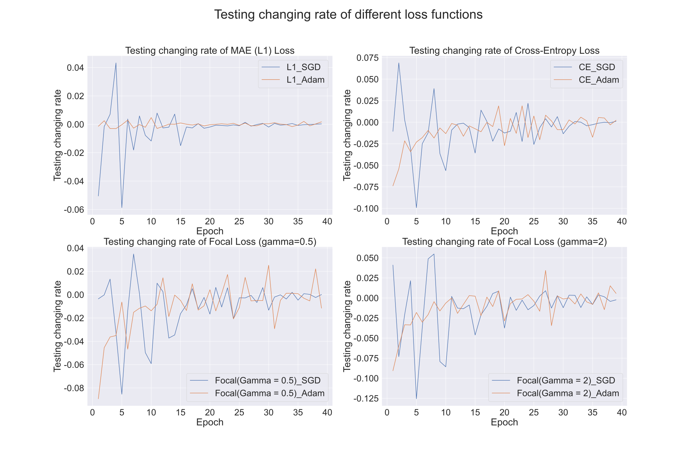
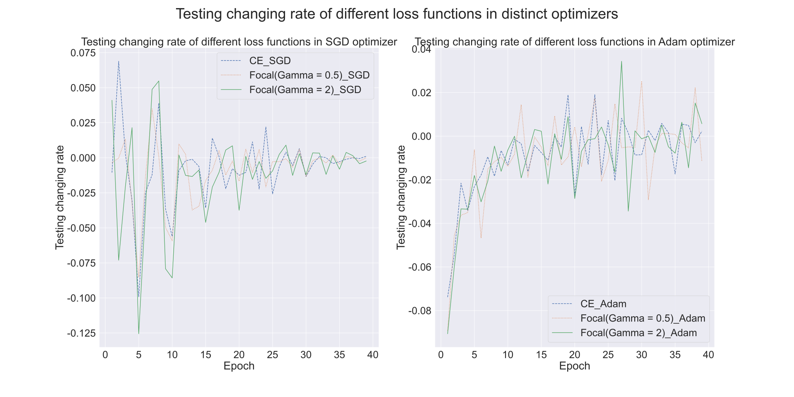
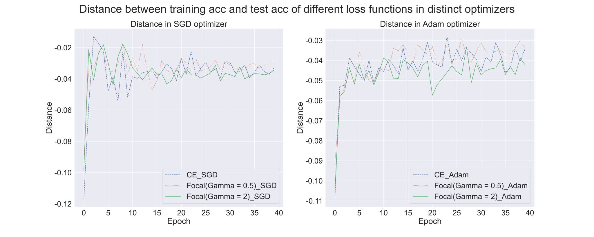

# Artificial Intelligence-Homework 1

**Name：**张弛（ZHANG Chi）

**SID：**12110821


## Introduction

1. In this assignment, I design experiments to compare the test performance of 4 loss functions in multi-class classification task.  And loss functions are given specifically below:	

	- MAE(L1) loss: `criterion1 = nn.L1Loss()`

	- CE (Cross-Entropy) Loss: `criterion2 = nn.CrossEntropyLoss()`

	- Focal Loss (gamma=0.5): `criterion3 = FocalLoss(gamma=0.5, alpha=None)`

	- Focal Loss (gamma=2): `criterion4 = FocalLoss(gamma=2, alpha=None)`

		```python
		class FocalLoss(nn.Module):
		    def __init__(self, gamma=2, alpha=None):
		        super(FocalLoss, self).__init__()
		        self.gamma = gamma
		        self.alpha = alpha
		
		    def forward(self, output, target):
		        # 计算交叉熵损失
		        ce_loss = F.cross_entropy(output, target, reduction='none')
		
		        # 计算概率
		        pt = torch.exp(-ce_loss)
		
		        # 计算Focal Loss
		        focal_loss = ((1 - pt) ** self.gamma) * ce_loss
		
		        # 加权Focal Loss
		        if self.alpha is not None:
		            assert len(self.alpha) == output.size(1), "Alpha must have the same length as the number of classes."
		            alpha = self.alpha[target]
		            focal_loss = focal_loss * alpha
		
		        return focal_loss.mean()
		```
	
2. To quantify the performance, here is some metrics for each loss function.

	- Accuracy: Computes the accuracy rate of the model on the test set to assess the predictive power of the model.
	- Model Convergence Speed: Evaluated by monitoring the loss value changes by function  at each training epoch. Here I use function ``.pct_change()`` to get percentage change between each element in the list and its preceding element, and the more it nears zero, the closer to convergence of the loss function.
	- Overfitting and Generalization: If the difference between training loss and test loss is small, then the model has good generalization ability. Conversely, if the difference between training loss and test loss is large, then the model may have an overfitting problem, i.e., it performs well on the training set but poorly on the test set. In addition, we can evaluate the generalization ability of the model by observing the trend of test loss. If the test loss remains stable or decreases after the training rounds increase, the model has good generalization ability. On the other hand, if the test loss starts to rise after the number of training rounds increases, then the model may have an overfitting problem.
	- Sensitivity: Introducing noise(in norm distribution) into the input data  by `image_noise = image + torch.randn(image.size())` and then observing the change in testing loss values. The degree of fluctuation of the loss value can indicate the sensitivity of the model to noise.

3. Some hyperparameters: For every loss functions, they have same hyperparameters in one comparative experiment.

	- `NUM_EPOCHS = 40`: The number of epochs, here is constant in 40 as the model can get converged.
	- `BATCH_SIZE = 128`: The number of examples in each mini-batch, which is set to be 128 by default.
	- `LEARNING_RATE = 1e-1`: Used for SGD optimizer.
	
4. Optimizer: I use 2 optimizers to train and test the data for each loss functions respectively.

	- SGD: `optimizer = optim.SGD(model.parameters(), lr=LEARNING_RATE, momentum=MOMENTUM)`
	
	- Adam: `optimizer = optim.Adam(model.parameters())`

5. I encapsulate the processes of training model and testing model into a function `model_training(NUM_EPOCHS, EVAL_INTERVAL,SAVE_DIR,model, criterion, loss_name)`. For each loss function, I call the function with different `criterion` and `loss_name`.
	- `model_training(NUM_EPOCHS,EVAL_INTERVAL, SAVE_DIR, ConvNet(), criterion1, "MAE (L1) Loss.csv")`
    - `model_training(NUM_EPOCHS,EVAL_INTERVAL, SAVE_DIR, ConvNet(), criterion2, "CE (Cross-Entropy) Loss.csv")`
    - `model_training(NUM_EPOCHS,EVAL_INTERVAL, SAVE_DIR, ConvNet(), criterion3, "Focal Loss (gamma=0.5).csv")`
    - `model_training(NUM_EPOCHS,EVAL_INTERVAL, SAVE_DIR, ConvNet(), criterion4, "Focal Loss (gamma=2).csv")`

	After running the `Assignment01.ipynb`, there will be 4 `.csv` files (corresponding to four loss functions) in `data_new` directory. Then going to `Assignment1_analyse.ipynb` for analyzing.
	
	

## Data analyse

For each loss function, we have 12 lists to storage their expression abilities:

| List Name             |                                                              |
| :-------------------- | :----------------------------------------------------------- |
| `training_loss_SGD`   | The value of loss function in SGD optimizer while training   |
| `training_acc_SGD`    | The accuracy rate of model  in SGD optimizer while training  |
| `testing_loss_SGD`    | The value of loss function in SGD optimizer while testing    |
| `testing_acc_SGD`     | The accuracy rate of model  in SGD optimizer while testing   |
| `testing_loss_SGD_S`  | The value of loss function  in SGD optimizer while testing after adding noise to input image |
| `testing_acc_SGD_S`   | The accuracy rate of model  in SGD optimizer while testing after adding noise to input image |
| `training_loss_Adam`  | The value of loss function in Adam optimizer while training  |
| `training_acc_Adam`   | The accuracy rate of model  in Adam optimizer while training |
| `testing_loss_Adam`   | The value of loss function in Adam optimizer while testing   |
| `testing_acc_Adam`    | The accuracy rate of model  in Adam optimizer while testing  |
| `testing_loss_Adam_S` | The value of loss function  in Adam optimizer while testing after adding noise to input image |
| `testing_acc_Adam_S`  | The accuracy rate of model  in Adam optimizer while testing after adding noise to input image |

###  Accuracy

1. From the picture below, except for `L1 Loss`, the testing accuracy of other 3 loss functions have an overall increasing trend. In addition,  we can also find that, to some extent, Adam optimizer has great advantages in improving the accuracy of the model.


> According to the figure, after referring some materials, I find that `L1 Loss` is not good at multi-classification. So I will not talk much about it in the second half of the report.

2. Inspecting the picture,  there are same performances in distinct loss functions. It is notable that, in SGD optimizer,  `Focal Loss(Gamma = 0.5)`has the highest accuracy, while in Adam, it is `CE Loss` that is greatest.



### Convergence Speed

1. As presented in the diagram, for 3 loss functions, Adam optimizer has a better performance in convergence speed than SGD optimizer, which can make loss functions converge faster. More specifically, loss function in Adam can be approximately converged in 15 epochs instead of nearly 25 epochs like SGD. However, the Adam comes to be more fluctuated than SGD in the second half of the epochs.



2. In SGD optimizer, It can be found from the figure that the `Focal Loss(Gamma = 0.5)`is converging faster than `Cross-Entropy Loss`and `Focal Loss(Gamma = 2)`.



### Overfitting and Generalization

1. In each sub graph, the training loss and test loss decrease gradually with the increase of training rounds. This is because as the model is trained, the model gradually learns better feature representations, resulting in lower loss values. And for 3 distinct loss function, it is clear that all the testing losses are lower than the training loss, meaning that models have good performance in the generalization instead of overfitting (maybe it is just underfitting).


2. Then we need to note the difference between training losses and testing losses. The closer distance can get to 0, the more model will generalize. Hence, both in SGD and Adam optimizers,  the generalization of `Focal Loss(Gamma = 0.5)` is remarkable, then `CE Entropy Loss`, and `Focal Loss(Gamma = 2)`follows. 




###  Sensitivity

1.  The picture below shows the changes between testing output from noise input and testing output from original input, which are calculated by `loss_noise - loss_no_noise`and `acc_noise - acc_no_noise`. Even though all 3 loss functions have inconsistent performance in value, they have same expression that change of testing accuracy in SGD optimizer is always negative while in Adam optimizer it is always positive. 

	> To some degree, model in Adam optimizer have a excellent ability of generalization.
	


2. To test the sensitivity of model, I compute changes of accuracy of loss function between noise and no-noise. So the bigger variation indicates the model is more sensitive to noise.  Then, in this figure, we can distinguish that , in SGD optimizer,`Focal Loss(Gamma = 0.5)`is the most sensitive, then`Focal Loss(Gamma = 2)`, and`Cross Entropy Loss`the last. And in Adam optimizer, `CE Loss`also be  less sensitive.


## Summary

In this assignment, I conducted experiments to compare the test performance of four different loss functions in a multi-class classification task. The loss functions evaluated are MAE (L1) loss, CE (Cross-Entropy) loss, Focal Loss with gamma equal to 0.5, and Focal Loss with gamma equal to 2.  Besides, I employed two optimizers, namely SGD and Adam, to train and test the models for each loss function.

The evaluation metrics used to quantify the performance of the models include accuracy, model convergence speed, overfitting and generalization, and sensitivity to noise. Here's a summary of the findings:

- **Accuracy: **`Focal Loss(Gamma = 0.5)`achieved the highest testing accuracy among the four loss functions in SGD optimizer, while L1 Loss performed poorly in multi-class classification.
- **Convergence Speed:** Adam showed faster convergence compared to SGD. Among the loss functions in SGD, `Focal Loss(Gamma = 0.5)` converged the fastest, followed by `Focal Loss (Gamma = 2)` and `Cross-Entropy Loss`.
- **Overfitting and Generalization**:
	
	- All three loss functions demonstrated good generalization as the testing losses were consistently lower than the training losses.
	- Both in SGD and Adam optimizer, `Focal Loss (Gamma = 0.5)` exhibited the best generalization, followed by `Focal Loss (Gamma = 2)`and`Cross-Entropy Loss` .
- **Sensitivity to Noise**:
	
	- In SGD optimizer, the models were sensitive to noise,  with `Focal Loss (Gamma = 0.5)` being the most sensitive, followed by `Focal Loss (Gamma = 2)`and`Cross-Entropy Loss`.
	- In Adam optimizer, the models showed less sensitivity to noise.
	
	> The sensitivity experiment needs improving much as I only introduce one kind of noise in normal distribution due to the time limit and more researches need to be conducted.

The results suggest that `Focal Loss (Gamma = 0.5)` is generally more suitable for multi-class classification tasks, with Adam as the preferred optimizer due to its faster convergence and less sensitive. 


## A mistake I made —— A ‘magic’ result

> This segment is about a mistake happened when I running my code, which presented me a  ‘magic’ result.

Before correcting my code, Adam is the optimizer behind SGD. And after training the model in SGD optimizer, I forgot to eliminate model parameters so that the result in Adam optimizer is prominent. 

For this situation, I mistakenly make two different optimizers train on the identical model. And it seems to work better, as if model in SGD optimizer falls into a local optimum. 


What’s more, the performance of `Focal Loss(Gamma = 0.5)`is extremely exceptional. It seems that `Focal Loss(Gamma =0.5)`is more suitable for the multi-classification task and its superiority was disclosed by increasing training epochs. Anyway, more researches need to be conducted.

